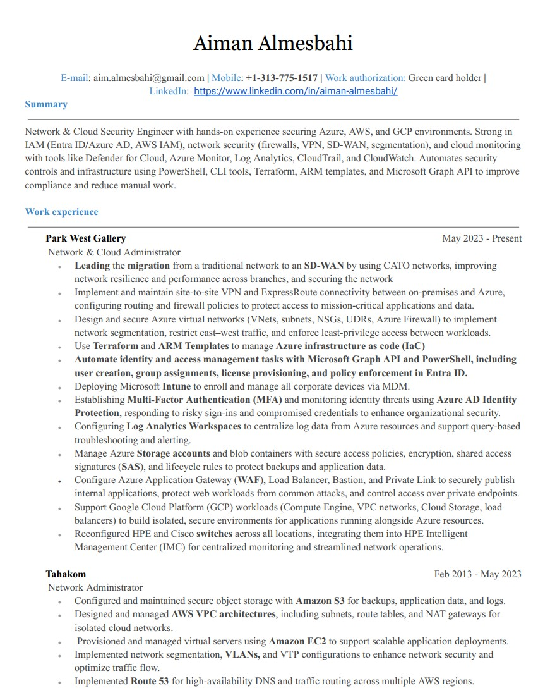
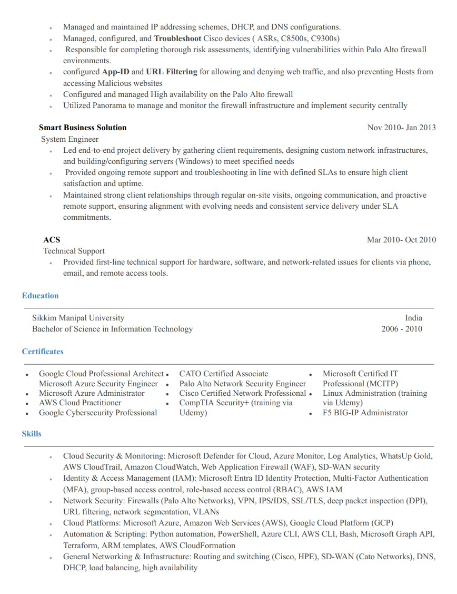
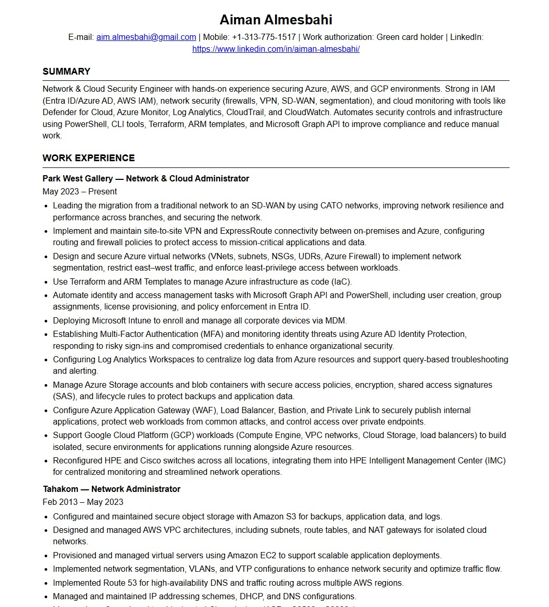

# Frontend Technical Specification

- Create a statci website that serves an html resume.

## Resume Format Considerations

I am going to use the [Harvard Resume Template](https://careerservices.fas.harvard.edu/channels/create-a-resume-cv-or-cover-letter/#uc_resource_tiles-4) format as the basis of my resume.


### Harvard Resume Format Generation

I know HTML very well, so I'm going to let GenAI do the heavy lifting and generate out html and possible CSS and from there I will refactor the code to preferred standard.

Prompt to ChatGPT 5:

```text
convert this resume format into html.
please don't use a css framework.
please use the least amount of css tags
```

Image provided to LLM:




This is [generated output](./docs/Nov-23-2025-resume.html) which I will refactor:

## HTML Adjustment
- Because we will be applying mobile styiling to our website we will inclue the viewport meta tag <meta name="viewport" content="width=device-width, initial-scale=1.0"> so mobile styling scale normally 

- the head has to be in the middle and I had to move it

- I added underline for each section in the resume

here is how it looks now
